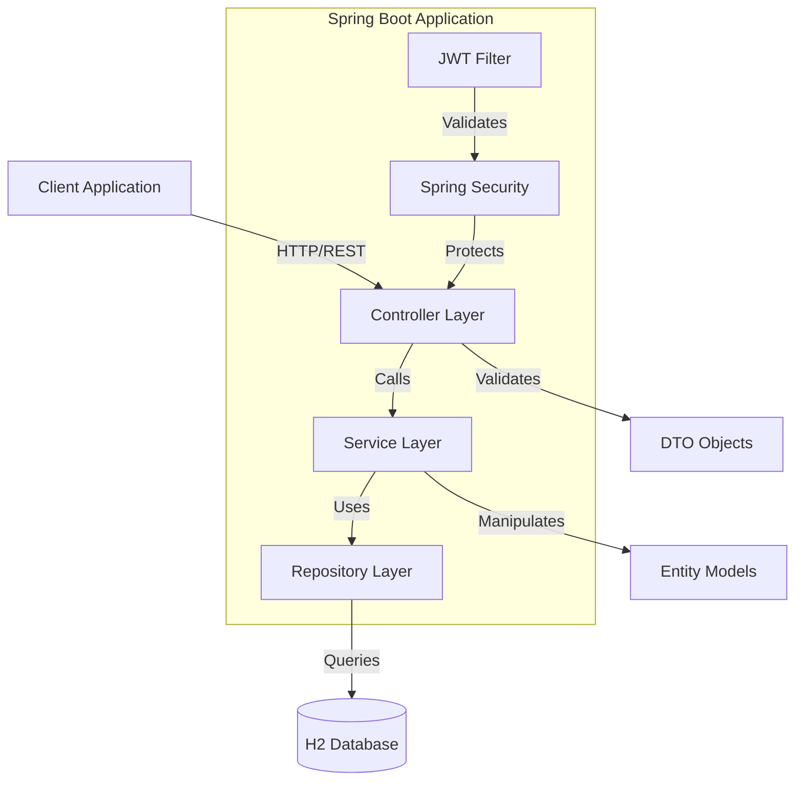
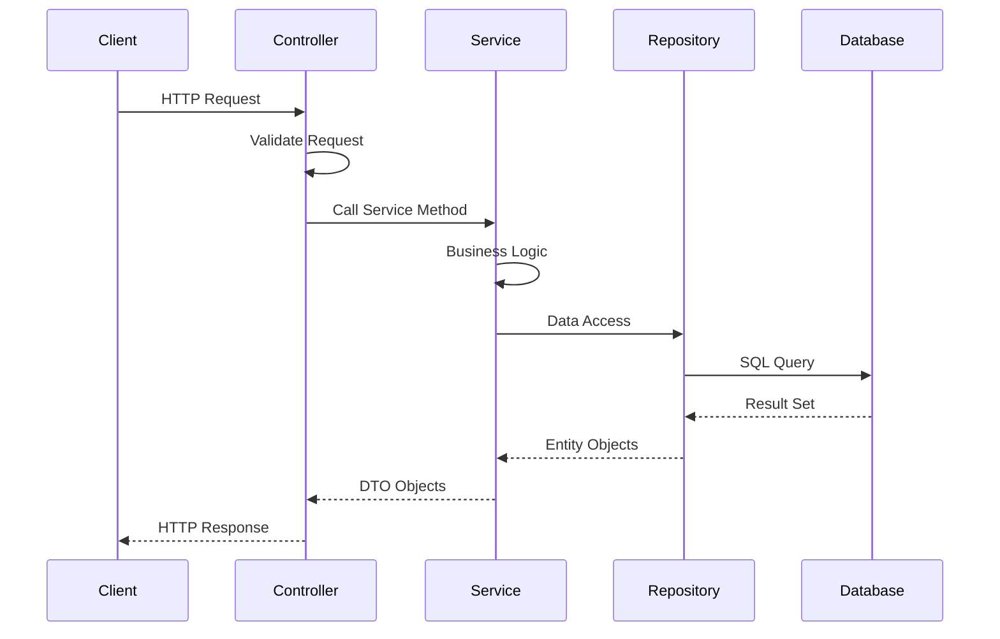

# Architecture Documentation

## File and Directory Structure

```
openflow-backend/
├── src/
│   ├── main/
│   │   ├── java/
│   │   │   └── com/
│   │   │       └── openflow/
│   │   │           ├── Application.java          # Main Spring Boot application
│   │   │           ├── config/                   # Configuration classes
│   │   │           │   ├── DataInitializer.java  # Database initialization
│   │   │           │   ├── JwtAuthenticationFilter.java  # JWT filter
│   │   │           │   ├── JwtUtil.java         # JWT utilities
│   │   │           │   └── SecurityConfig.java   # Security configuration
│   │   │           ├── controller/              # REST controllers
│   │   │           │   ├── AuthController.java
│   │   │           │   ├── BoardController.java
│   │   │           │   ├── StatusController.java
│   │   │           │   └── TaskController.java
│   │   │           ├── dto/                      # Data Transfer Objects
│   │   │           │   ├── AuthRequest.java
│   │   │           │   ├── AuthResponse.java
│   │   │           │   └── RegisterRequest.java
│   │   │           ├── model/                    # Entity models
│   │   │           │   ├── Board.java
│   │   │           │   ├── Status.java
│   │   │           │   ├── Task.java
│   │   │           │   └── User.java
│   │   │           ├── repository/               # JPA repositories
│   │   │           │   ├── BoardRepository.java
│   │   │           │   ├── StatusRepository.java
│   │   │           │   ├── TaskRepository.java
│   │   │           │   └── UserRepository.java
│   │   │           └── service/                   # Business logic
│   │   │               ├── BoardService.java
│   │   │               ├── JwtService.java
│   │   │               ├── StatusService.java
│   │   │               ├── TaskService.java
│   │   │               └── UserService.java
│   │   └── resources/
│   │       └── application.properties            # Application configuration
│   └── test/                                      # Test classes (to be created)
├── Dockerfile                                     # Container build definition
├── pom.xml                                       # Maven project configuration
└── docs/                                         # Documentation
```

## Architecture Diagram



## Layer Responsibilities

### Controller Layer
- Handle HTTP requests and responses
- Request validation
- Response formatting
- Exception handling
- Authentication checks

### Service Layer
- Business logic implementation
- Transaction management
- Data validation
- Cross-cutting concerns

### Repository Layer
- Data access abstraction
- JPA query methods
- Database operations
- Entity management

### Model Layer
- Entity definitions
- Relationships mapping
- Validation annotations
- JPA configuration

## Data Flow



## Package Organization

- **com.openflow**: Root package
- **com.openflow.config**: Configuration classes
- **com.openflow.controller**: REST controllers
- **com.openflow.dto**: Data Transfer Objects
- **com.openflow.model**: Entity models
- **com.openflow.repository**: JPA repositories
- **com.openflow.service**: Business logic services


