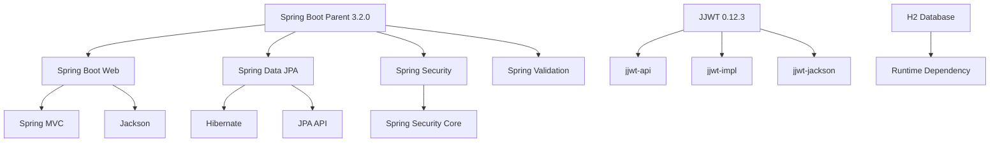

# Dependencies

## Core Dependencies

### Spring Boot Parent
- **Version**: 3.2.0
- **Purpose**: Provides dependency management and default configurations
- **Managed Versions**: All Spring dependencies inherit versions from parent POM

### Spring Boot Web
- **Artifact**: `spring-boot-starter-web`
- **Version**: Managed by parent (3.2.0)
- **Purpose**: REST API support, embedded Tomcat server
- **Includes**: Spring MVC, Jackson, validation

### Spring Data JPA
- **Artifact**: `spring-boot-starter-data-jpa`
- **Version**: Managed by parent (3.2.0)
- **Purpose**: Data persistence abstraction
- **Includes**: Hibernate, JPA API, transaction management

### Spring Security
- **Artifact**: `spring-boot-starter-security`
- **Version**: Managed by parent (3.2.0)
- **Purpose**: Authentication and authorization
- **Includes**: Security filters, password encoding

### Spring Boot Validation
- **Artifact**: `spring-boot-starter-validation`
- **Version**: Managed by parent (3.2.0)
- **Purpose**: Bean validation (JSR-303)
- **Includes**: Hibernate Validator

## Database

### H2 Database
- **Artifact**: `h2`
- **Version**: Managed by parent
- **Scope**: runtime
- **Purpose**: In-memory database for development
- **Note**: Replace with PostgreSQL/MySQL for production

## Authentication

### JJWT (Java JWT)
- **Artifact**: `jjwt-api`, `jjwt-impl`, `jjwt-jackson`
- **Version**: 0.12.3
- **Purpose**: JWT token generation and validation
- **Components**:
  - `jjwt-api`: API interfaces
  - `jjwt-impl`: Implementation
  - `jjwt-jackson`: Jackson JSON support

## Development Tools

### Lombok
- **Artifact**: `lombok`
- **Version**: Managed by parent
- **Scope**: Provided (compile-time only)
- **Purpose**: Reduces boilerplate code
- **Features Used**: `@Data`, `@Entity`, `@Getter`, `@Setter`, `@RequiredArgsConstructor`

## Testing

### Spring Boot Test
- **Artifact**: `spring-boot-starter-test`
- **Version**: Managed by parent (3.2.0)
- **Scope**: test
- **Includes**: 
  - JUnit 5
  - Mockito
  - AssertJ
  - Spring Test
  - Hamcrest

## Build Tools

### Maven
- **Version**: 3.9+ (via Maven Wrapper)
- **Purpose**: Build automation and dependency management

### Spring Boot Maven Plugin
- **Version**: Managed by parent (3.2.0)
- **Purpose**: Package executable JAR, run application

## Java Version

- **Java**: 17 (Eclipse Temurin)
- **Compatibility**: Java 17+
- **Features Used**: Records, pattern matching, text blocks

## Runtime Requirements

- **Java Runtime**: JRE 17 or higher
- **Memory**: Minimum 512MB, recommended 1GB
- **Disk**: ~100MB for application JAR

## Dependency Tree



## Version Management Strategy

- Spring dependencies: Managed by Spring Boot parent POM
- Third-party libraries: Explicitly versioned in POM
- Security updates: Regular review and updates
- Breaking changes: Documented in CHANGELOG

## Dependency Updates

To check for dependency updates:
```bash
mvn versions:display-dependency-updates
mvn versions:display-plugin-updates
```

## Security Considerations

- All dependencies are from trusted repositories (Maven Central)
- Regular security scanning recommended
- Keep dependencies up-to-date
- Review transitive dependencies

