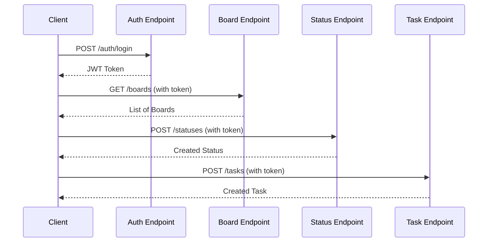

# API Documentation

## Base URL

- **Development**: `http://localhost:8080/api`
- **Production**: `https://api.openflow.example.com/api`

## Authentication

All endpoints except `/auth/register` and `/auth/login` require JWT authentication.

### Headers
```
Authorization: Bearer <jwt_token>
Content-Type: application/json
```

## Endpoints

### Authentication

#### Register User
```http
POST /api/auth/register
```

**Request Body:**
```json
{
  "username": "string",
  "email": "string",
  "password": "string"
}
```

**Response:** `200 OK`
```json
{
  "token": "string",
  "username": "string"
}
```

**Error Responses:**
- `400 Bad Request`: Validation failed or username/email already exists

#### Login
```http
POST /api/auth/login
```

**Request Body:**
```json
{
  "username": "string",
  "password": "string"
}
```

**Response:** `200 OK`
```json
{
  "token": "string",
  "username": "string"
}
```

**Error Responses:**
- `400 Bad Request`: Invalid credentials

### Boards

#### Get All Boards
```http
GET /api/boards
```

**Headers:** `Authorization: Bearer <token>`

**Response:** `200 OK`
```json
[
  {
    "id": 1,
    "name": "Project Board",
    "description": "Main project board",
    "userId": 1,
    "createdAt": "2024-01-01T00:00:00"
  }
]
```

#### Get Board by ID
```http
GET /api/boards/{id}
```

**Headers:** `Authorization: Bearer <token>`

**Response:** `200 OK`
```json
{
  "id": 1,
  "name": "Project Board",
  "description": "Main project board",
  "userId": 1,
  "createdAt": "2024-01-01T00:00:00"
}
```

**Error Responses:**
- `404 Not Found`: Board not found or access denied

#### Create Board
```http
POST /api/boards
```

**Headers:** `Authorization: Bearer <token>`

**Request Body:**
```json
{
  "name": "string",
  "description": "string"
}
```

**Response:** `200 OK`
```json
{
  "id": 1,
  "name": "New Board",
  "description": "Board description",
  "userId": 1,
  "createdAt": "2024-01-01T00:00:00"
}
```

#### Update Board
```http
PUT /api/boards/{id}
```

**Headers:** `Authorization: Bearer <token>`

**Request Body:**
```json
{
  "name": "string",
  "description": "string"
}
```

**Response:** `200 OK` (updated board)

#### Delete Board
```http
DELETE /api/boards/{id}
```

**Headers:** `Authorization: Bearer <token>`

**Response:** `204 No Content`

### Statuses

#### Get Statuses by Board
```http
GET /api/statuses/board/{boardId}
```

**Headers:** `Authorization: Bearer <token>`

**Response:** `200 OK`
```json
[
  {
    "id": 1,
    "name": "To Do",
    "color": "#82AAFF",
    "boardId": 1,
    "order": 0,
    "createdAt": "2024-01-01T00:00:00"
  }
]
```

#### Get Status by ID
```http
GET /api/statuses/{id}
```

**Headers:** `Authorization: Bearer <token>`

**Response:** `200 OK` (status object)

#### Create Status
```http
POST /api/statuses
```

**Headers:** `Authorization: Bearer <token>`

**Request Body:**
```json
{
  "name": "string",
  "color": "#82AAFF",
  "boardId": 1,
  "order": 0
}
```

**Response:** `200 OK` (created status)

#### Update Status
```http
PUT /api/statuses/{id}
```

**Headers:** `Authorization: Bearer <token>`

**Request Body:**
```json
{
  "name": "string",
  "color": "#82AAFF",
  "order": 0
}
```

**Response:** `200 OK` (updated status)

#### Delete Status
```http
DELETE /api/statuses/{id}
```

**Headers:** `Authorization: Bearer <token>`

**Response:** `204 No Content`

### Tasks

#### Get Tasks by Board
```http
GET /api/tasks?boardId={boardId}
```

**Headers:** `Authorization: Bearer <token>`

**Response:** `200 OK`
```json
[
  {
    "id": 1,
    "title": "Task Title",
    "description": "Task description",
    "statusId": 1,
    "boardId": 1,
    "createdAt": "2024-01-01T00:00:00"
  }
]
```

#### Get Task by ID
```http
GET /api/tasks/{id}
```

**Headers:** `Authorization: Bearer <token>`

**Response:** `200 OK` (task object)

#### Create Task
```http
POST /api/tasks
```

**Headers:** `Authorization: Bearer <token>`

**Request Body:**
```json
{
  "title": "string",
  "description": "string",
  "statusId": 1,
  "boardId": 1
}
```

**Response:** `200 OK` (created task)

#### Update Task
```http
PUT /api/tasks/{id}
```

**Headers:** `Authorization: Bearer <token>`

**Request Body:**
```json
{
  "title": "string",
  "description": "string",
  "statusId": 1,
  "boardId": 1
}
```

**Response:** `200 OK` (updated task)

#### Delete Task
```http
DELETE /api/tasks/{id}
```

**Headers:** `Authorization: Bearer <token>`

**Response:** `204 No Content`

## Error Responses

### Standard Error Format
```json
{
  "error": "Error message description"
}
```

### HTTP Status Codes

- `200 OK`: Request successful
- `201 Created`: Resource created (if applicable)
- `204 No Content`: Request successful, no content to return
- `400 Bad Request`: Invalid request data or validation failed
- `401 Unauthorized`: Authentication required or invalid token
- `403 Forbidden`: Access denied
- `404 Not Found`: Resource not found
- `500 Internal Server Error`: Server error

## Rate Limiting

Currently not implemented. Consider adding rate limiting for production.

## CORS

CORS is configured to allow requests from configured origins (default: `http://localhost:3000`).

## API Flow Diagram




