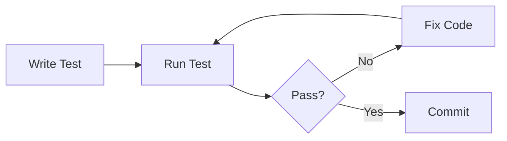
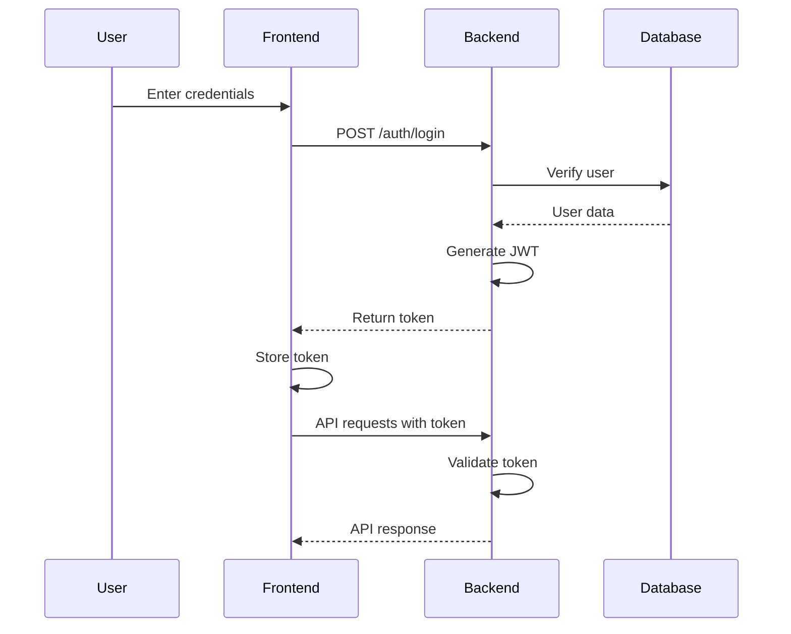

# Common Workflows

## Development Workflow

### Setting Up Development Environment

1. Clone repository
2. Install Java 17 and Maven
3. Configure IDE (IntelliJ IDEA or Eclipse)
4. Run application locally
5. Access H2 console for database inspection

### Making Changes

1. Create feature branch
2. Implement changes following coding standards
3. Write tests for new functionality
4. Run tests locally
5. Commit with conventional commit format
6. Push and create pull request

### Testing Workflow

## Common Tasks

### Creating a New Entity

1. Create model class in `com.openflow.model`
2. Add JPA annotations (`@Entity`, `@Table`)
3. Create repository interface in `com.openflow.repository`
4. Create service class in `com.openflow.service`
5. Create controller in `com.openflow.controller`
6. Add validation annotations
7. Write tests

### Adding a New Endpoint

1. Define endpoint in controller
2. Add request/response DTOs if needed
3. Implement service method
4. Add repository methods if needed
5. Write integration tests
6. Update API documentation

### Database Migration

1. Update entity models
2. Hibernate auto-updates schema (development)
3. For production: Create migration scripts
4. Test migration on staging

### Authentication Flow

### Board Creation Flow

1. User authenticates and receives JWT token
2. Frontend sends POST request to `/api/boards` with token
3. Backend validates token and extracts user ID
4. Service creates board with user association
5. Repository saves to database
6. Response returns created board

### Task Management Flow

1. User selects a board
2. Frontend fetches statuses for board
3. User creates task in a status
4. Frontend sends POST to `/api/tasks`
5. Backend validates task data and user permissions
6. Task is saved and associated with status and board
7. Response returns created task

## Deployment Workflow

### Building for Production

1. Update `application.properties` for production database
2. Set secure JWT secret
3. Configure CORS for production domain
4. Build JAR: `mvn clean package`
5. Test JAR locally
6. Build Docker image
7. Push to container registry

### Container Deployment

1. Build image: `podman build -t openflow-backend:latest .`
2. Tag for registry: `podman tag openflow-backend:latest registry/openflow-backend:v1.0.0`
3. Push to registry: `podman push registry/openflow-backend:v1.0.0`
4. Deploy using `kube.yaml` from deployment repository

## Troubleshooting Workflow

### Application Won't Start

1. Check Java version: `java -version`
2. Verify port availability: `lsof -i :8080`
3. Check application.properties configuration
4. Review logs for errors
5. Verify database connectivity

### Tests Failing

1. Run tests individually to isolate issue
2. Check test database configuration
3. Verify mock setup
4. Review test logs
5. Ensure test data is properly cleaned up

### API Errors

1. Verify JWT token is valid and not expired
2. Check request format matches API documentation
3. Review server logs for detailed error messages
4. Verify user permissions for resource access
5. Check database constraints

## Integration Workflow

### Integrating with Frontend

1. Ensure CORS is configured for frontend origin
2. Share API documentation with frontend team
3. Coordinate on data formats
4. Test integration endpoints
5. Monitor cross-origin requests

### Database Integration

1. Choose production database (PostgreSQL/MySQL)
2. Update datasource configuration
3. Test connection and migrations
4. Verify data integrity
5. Set up backup strategy

